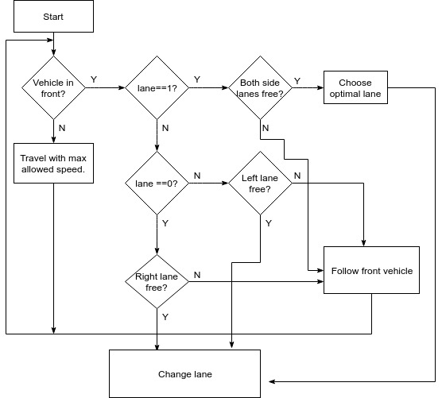
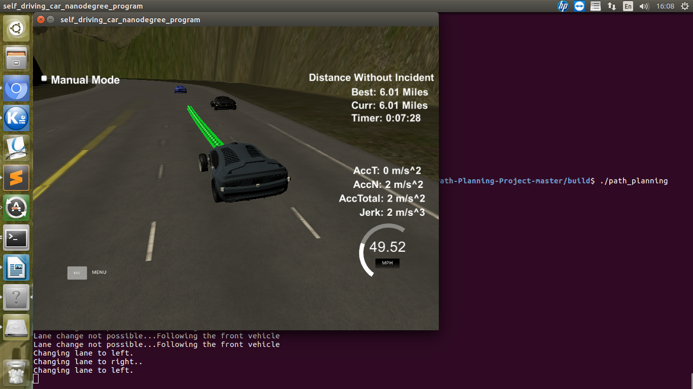

# Self Driving Car Nanodegree

## Path Planning Project

### Introduction

Goal of this project is to safely navigate around a virtual highway. Information about position and velocity of ego car as well as other cars in the simulation is provided by the simulator. A sparse map of waypoints is also provided. The vehicle has to safely drive on the highway, avoiding collision with any vehicle that comes in its path by either slowing down to follow the leading vehicle or by changing lanes whenever possible.

### Implementation Details

The simulator accepts trajectory points of ego vehicle in the form of discrete way points. Vehicle follows these way points accurately and spacing between these waypoints decide the velocity of the ego vehicle as each waypoint is reached after exactly 20ms from its previous waypoint. 
The project included various challenges, following subsections give details of these challenges and how they were dealt with.

#### Driving vehicle in a lane:
To make the vehicle drive in  a lane is not easy using x-y coordinates. Not as easy as in Frenet coordinates. Frenet (s-d) coordinate system transforms the curvy road in a straight road with s denoting the length of traversed path and d denoting the distance from road centre. To make a vehicle travel in a praticular lane, we generate way points of the vehicle using a fixed d value. That way, vehice will always remain in the desired lane and we won’t have to do geometrical calculations that we had to do if we were to use x-y coordinates. 

#### Generating smooth waypoints:
Waypoints that we generate in one simulation time use the current position and yaw. That may cause a discontinuity when waypoints of successive simualtion step are appended causing vehicle to abruptly change its yaw and thus violating the lateral acceleration condition. To deal with this, waypoints of previous simulation step are appended by the waypoints generated in current time step. The number of total waypoints are fixed and waypoints of last sim step that remained to be transformed are retained and new waypoints are generated in continuation to that.
This however, doesnot completely solve the problem. To solve it, we use spline library. This library will generate a fitting polynomial using the given inputs such that the generated polynomial (spline) will pass through each data point passed to it and will be continous. Spline is generated by passing current vehicle position and a few points at some distance ahead of the vehicle. The generated spline can then be used to get intemediate points using interpolation. Code snippet is shown below.

```c++
for(int i = 0; i< previous_path_x.size();i++){
          		next_x_vals.push_back(previous_path_x[i]);
          		next_y_vals.push_back(previous_path_y[i]);          		
          	} 
```

#### Avoid hitting leading vehicle in lane:
To prevent ego vehicle from hitting its leading vehicle, we contiously parse through the sensor fusion information to detect a vehicle in its own lane and ahead of ego vehicle. If there is a vehicle in its lane, which is less than 30 meters ahead of it, then we decrease the velocity of the vehicle using a decceleration rate which is dependent on the separation and difference in velocity of the two vehicles. This way we get a better vehicle following characteristics. Code snippet is shown below.

```c++
double decc = 0, acc = 0.4;
if(her_lane == lane && her_pred_s > end_path_s and her_pred_s < end_path_s+30){
                car_in_front = true;
                separation = her_pred_s - end_path_s;                
                del_v = ref_vel - her_abs_vel;                
                decc =  0.3*(del_v/separation); // Decceleration is set based on separation and velocity difference.
                MAX_VEL = her_abs_vel;
              }
```

Followed by  
```c++
if(car_in_front && ref_vel > MAX_VEL){
              ref_vel -= decc;
            }
            else if(ref_vel < MAX_VEL){
              ref_vel += acc;
            }  
```

#### Changing lane:
When there is a slow moving vehicle in the lane same as that of ego vehicle, ego vehicle checks for free left or right lane to start an overtaking maneuver. The logic to lane change is better to be desribed graphically. Following flow chart contains the lane changing logic.



#### Choosing optimal lane change:
When present in middle lane we have two options for lane change. Either right or left. To choose the better option we look for distance of next vehicle in both the lanes and lane corresponding to farther vehicle will be given priority over the other.

```c++
if((her_s - car_s)>0 && (her_s - car_s) < dist_ahead[her_lane]){
                dist_ahead[her_lane] = her_s - car_s;
              }
```

Followed by:  
```c++
if(car_in_front && !car_in_right && !car_in_right && lane == 1){
              if(dist_ahead[0] >= dist_ahead[2]) {
                lane -= 1;
                cout<<"Changing lane to left.."<<"\n";
              }
              else{
                lane += 1;
                cout<<"Changing lane to right.."<<"\n";  
              } 
            }
```


#### Generating smooth lane change trajectory:
To generate smooth lane change trajectroy, i have used spline library. I could have also used quintic polynomial for this purpose but spline was itself giving very gracefull lane change manuever. Hence i sticked to that. I used 50 meters ahead points to generate spline. Using 30 or 40 instead of 50 were giving not very satisfying result.




```python

```
